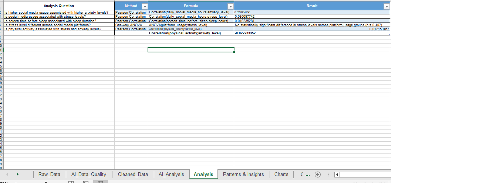
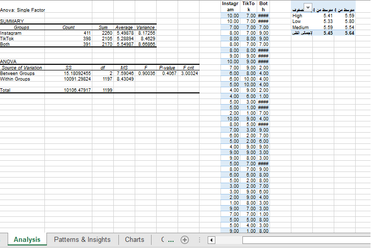
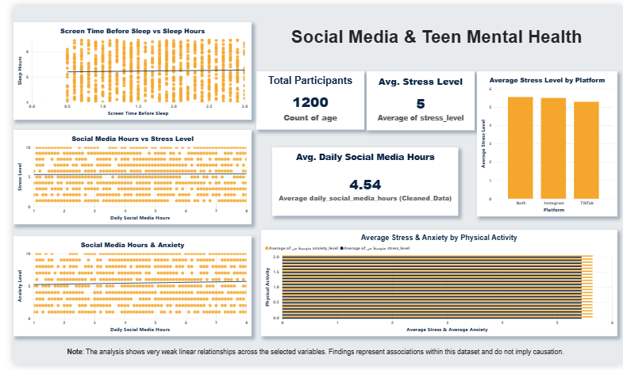
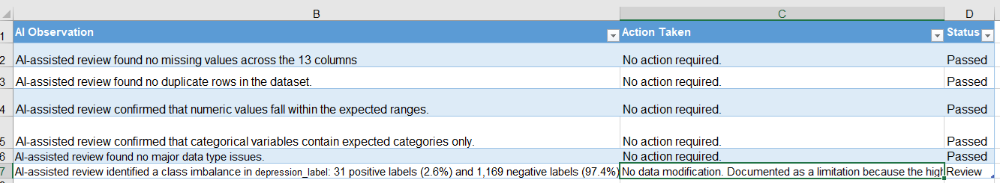
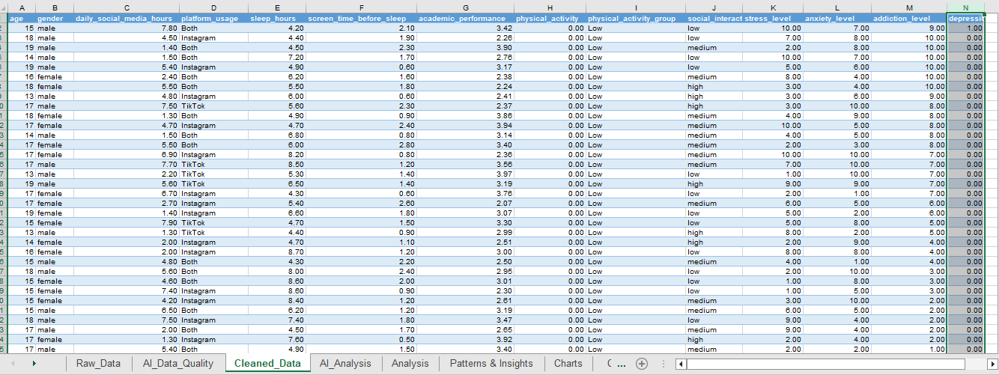
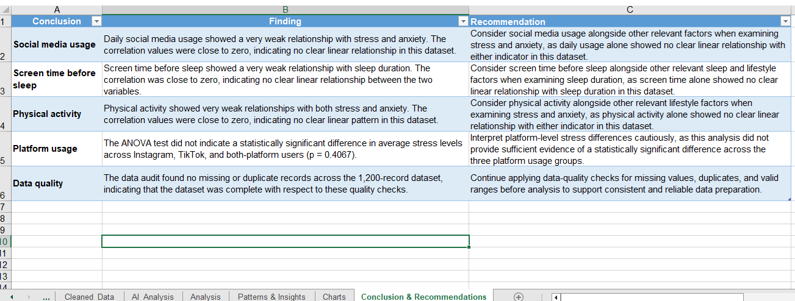

# Social Media Usage & Teen Mental Health

**Prepared by:** Bushra Fawaz
**Status:** Completed

## Project Overview

This project analyzes the relationships between social media usage and selected mental health and lifestyle indicators among teenagers.

The analysis focuses on daily social media usage, stress, anxiety, sleep duration, screen time before sleep, physical activity, and platform usage to identify patterns and relationships within the dataset.

## Dataset

* **Rows:** 1,200
* **Columns:** 13
* **Missing Values:** 0
* **Duplicate Rows:** 0

### Main Variables

* Age
* Gender
* Daily Social Media Hours
* Platform Usage
* Sleep Hours
* Screen Time Before Sleep
* Academic Performance
* Physical Activity
* Social Interaction Level
* Stress Level
* Anxiety Level
* Addiction Level
* Depression Label

## Tools Used

* Microsoft Excel
* Power BI
* AI-assisted data quality review

## Data Preparation

The dataset was reviewed and prepared before analysis.

The data quality audit confirmed:

* No missing values
* No duplicate records
* Numeric values were within expected ranges
* Categorical values were reviewed for consistency

## Analysis

The analysis examined:

1. Social Media Usage vs. Anxiety
2. Social Media Usage vs. Stress
3. Average Stress by Platform
4. Average Stress and Anxiety by Physical Activity
5. Screen Time Before Sleep vs. Sleep Duration

### Analysis Screenshots

## Dashboard

The final Power BI dashboard summarizes the main findings using KPI cards and visualizations.

## Data Quality Audit

## Cleaned Data

## Conclusion & Recommendations

### Key Findings

**Social Media Usage**

Daily social media usage showed a very weak relationship with stress and anxiety. The correlation values were close to zero, indicating no clear linear relationship in this dataset.

**Screen Time Before Sleep**

Screen time before sleep showed a very weak relationship with sleep duration. The correlation was close to zero, indicating no clear linear relationship between the two variables.

**Physical Activity**

Physical activity showed very weak relationships with both stress and anxiety. The correlation values were close to zero, indicating no clear linear pattern in this dataset.

**Platform Usage**

The ANOVA test did not indicate a statistically significant difference in average stress levels across Instagram, TikTok, and both-platform users (**p = 0.4067**).

**Data Quality**

The data audit found no missing or duplicate records across the 1,200-record dataset, indicating that the dataset was complete with respect to these quality checks.

## Recommendations

* Consider social media usage alongside other relevant factors when examining stress and anxiety, as daily usage alone showed no clear linear relationship with either indicator in this dataset.
* Consider screen time before sleep alongside other relevant sleep and lifestyle factors when examining sleep duration.
* Consider physical activity alongside other relevant lifestyle factors when examining stress and anxiety.
* Interpret platform-level stress differences cautiously, as this analysis did not provide sufficient evidence of a statistically significant difference across the three platform usage groups.
* Continue applying data-quality checks for missing values, duplicates, and valid ranges before analysis.

